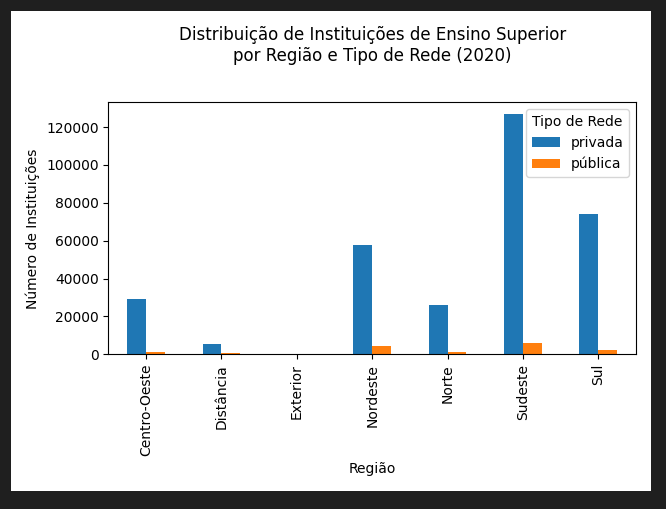

# analise_dados_educacao
Analise de dados do Ensino Superior Brasileiro - censo IBGE, 2020

Bem vindo(a) ao meu primeiro projeto de análise de dados! Este repositório apresenta uma análise exploratória dos dados do Censo IBGE de 2020 sobre o ensino superior no Brasil. Através da utilização de Python e bibliotecas como Pandas, Matplotlib e Jupyter Notebook, foram gerados gráficos e relatórios em PDF para identificar aspectos da desigualdade e desafios no setor educacional superior.

Tecnologias Utilizadas:

Python: Linguagem de programação principal.
Pandas: Manipulação e análise de dados.
Matplotlib: Criação de gráficos.
Jupyter Notebook: Ambiente interativo para desenvolvimento e apresentação de código.
FPDF: Geração de relatórios em PDF.

Exemplo de Gráfico:

