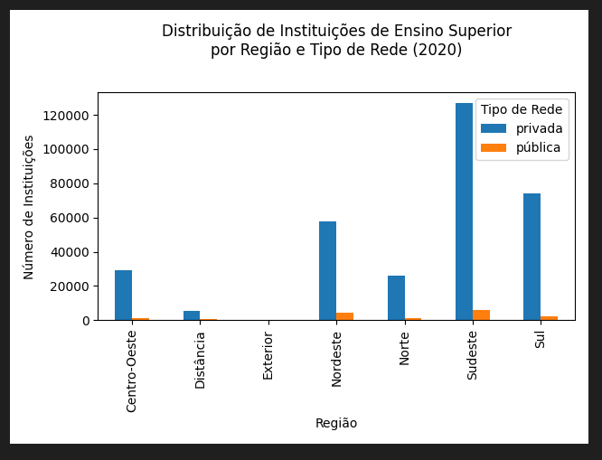

# analise_dados_educacao - ENGLISH VERSION BELOW
Analise de dados do Ensino Superior Brasileiro - censo IBGE, 2020

Bem vindo(a) ao meu primeiro projeto de análise de dados! Este repositório apresenta uma análise exploratória dos dados do Censo IBGE de 2020 sobre o ensino superior no Brasil. Através da utilização de Python e bibliotecas como Pandas, Matplotlib e Jupyter Notebook, foram gerados gráficos e relatórios em PDF para identificar aspectos da desigualdade e desafios no setor educacional superior, além disso, através dele é possivel identificar oportunidades de investimento para empresas interessadas no setor educacional.

Tecnologias Utilizadas:

Python: Linguagem de programação principal.
Pandas: Manipulação e análise de dados.
Matplotlib: Criação de gráficos.
Jupyter Notebook: Ambiente interativo para desenvolvimento e apresentação de código.
FPDF: Geração de relatórios em PDF.

Exemplo de Gráfico:

------------------------
Data Analysis of Brazilian Higher Education - IBGE Census, 2020

Welcome to my first data analysis project! This repository presents an exploratory analysis of data from the 2020 IBGE Census on higher education in Brazil. Through the use of Python and libraries such as Pandas, Matplotlib and Jupyter Notebook, graphs and PDF reports were generated to identify aspects of inequality and challenges in the higher education sector, in addition, through it it is possible to identify investment opportunities for companies interested in the education sector.

Technologies Used:

Python: Main programming language.
Pandas: Data manipulation and analysis.
Matplotlib: Creation of graphs.
Jupyter Notebook: Interactive environment for code development and presentation.
FPDF: Generation of PDF reports.

Example of Graph:

